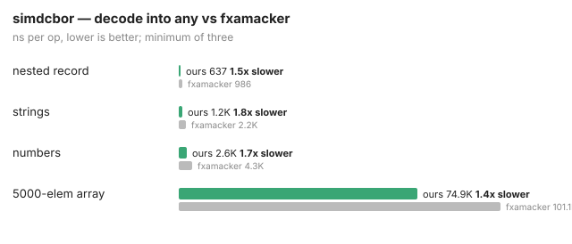

# simdcbor

CBOR (RFC 8949) decoding built on [simd.go](https://github.com/sebishogun/simd),
the binary sibling of [simdjson](https://github.com/sebishogun/simdjson):
one head-argument-body walk with different build steps for decode, strict
skip, framing, streaming, and exact values. SIMD enters in exactly one place:
validating a text
string's UTF-8 through simd's `ValidUTF8` kernel. Byte-string copying is
a plain memmove.

## API

The shipped API is small and exact:

```go
v, n, err := simdcbor.Unmarshal(data) // v is map[string]any / []any / ...
b, err := simdcbor.Marshal(v)         // the inverse, over the shaped set
n, err := simdcbor.Skip(data)         // frame an item without building it
n, err = simdcbor.SkipStrict(data)    // require Unmarshal's boundary
```

Errors are the two package-level values `ErrTruncated` and `ErrMalformed`.

## Shape — and where the subset stops

Decoded values match `encoding/json`'s for the same logical data: maps
become `map[string]any`, arrays `[]any`, all numbers `float64` (with the
usual `2^53` integer precision limit, as in `encoding/json`), so code
that consumed JSON into `any` consumes CBOR unchanged. Checked against
[fxamacker/cbor](https://github.com/fxamacker/cbor) for the bytes and
`encoding/json` for the shape, over a generated corpus, with truncation
and random-input fuzzing that must never panic.

This is the **JSON-shaped subset**, not a full RFC 8949 codec. Exactly
what is and is not supported, from the source:

| supported | not yet |
|---|---|
| definite arrays, maps, byte/text strings | indefinite-length forms (rejected, `ErrMalformed`) |
| unsigned, negative, half/single/double floats → `float64` | integer-exact decode (all numbers are `float64`) |
| tags (consumed and **discarded**; inner item decoded) | tag numbers, tag values |
| string map keys | arbitrary keys (non-string key → `ErrMalformed`) |
| simple values `false`/`true`/`null`, `undefined`→`nil`, floats 25–27 | simple values 0–19 (`0xe0`–`0xf3`) and the `0xf8` form: no JSON shape holds them, so `Unmarshal` rejects and `simdcbor/value` represents them |
| duplicate keys: last value wins | duplicate policies (error / first-wins) |
| depth up to 64 (exceeding → `ErrMalformed`) | configurable limits |
| `Marshal` types: `nil`, `bool`, `string`, `[]byte`, `float64`, `float32`, `int`, `int64`, `uint64`, `[]any`, `map[string]any` | `uint` and other fixed-width ints, arbitrary types |

Notes the source pins: `undefined` (`0xf7`) decodes to `nil` like `null`;
`[]byte` marshals as a byte string but unmarshals to `string`; text
strings are UTF-8-validated (`ErrMalformed` on invalid).

**Canonical, scoped.** `Marshal` sorts Go string keys with
`sort.Strings` and writes shortest-form heads and `float32` when it
round-trips — so the same map encodes to the same bytes, the property a
cache key needs. This is **not** RFC 8949 §4.2.1 core deterministic:
that order compares the encoded bytes of each key, head included
(`"z"` → `61 7a` sorts before `"aa"` → `62 61 61`), while
`sort.Strings` compares content bytes (`"aa"` first). The two coincide
where the encoded head cannot reverse the content comparison — e.g.
equal-length text keys, whose head bytes are identical. The §4.2.3
length-first legacy ordering is not implemented either, and the
encoder never emits `float16`. The "canonical" claim is exactly what
the code and tests prove, no more.

There is no tagged full-RFC release or root-adapter conformance claim. The
full codec implementation — exact value model, streaming decoder/encoder,
tags, arbitrary keys, deterministic modes, lazy values, and diagnostic
notation — lives in the packages described below. Its executed design and
remaining R2 release work are in the [design](docs/plans/2026-08-13-simdcbor-production-design.md),
[plan](docs/plans/2026-08-13-simdcbor-production.md), and [roadmap](docs/roadmap.md).

## Beyond decode

- **`Skip(data)`** advances past an item without building it — the
  filtering hot path. Decoding only 1 record in 100 of a stream and
  skipping the rest runs **8.4x** faster than decoding all of them
  (79 us vs 662 us), because Skip allocates nothing.

  `Skip` judges **framing**: the head is a head, the lengths fit, the
  nesting closes. It therefore accepts a superset of what `Unmarshal`
  builds — an integer map key, a simple value outside the JSON shapes,
  text that is not valid UTF-8. **`SkipStrict`** carries `Unmarshal`'s
  boundary exactly, for callers who need a skipped item to be a
  decodable one.

  The split is a measurement, not a preference. Folding the value-model
  checks into `Skip` costs +92.5% instructions on the filter benchmark,
  three quarters of it validating the contents of strings the caller is
  discarding unread ([docs/wrong.md](docs/wrong.md)). The inconsistency
  the earlier README recorded here — `Skip` accepting simple values
  `Unmarshal` rejects — was real, was one of four such divergences, and
  is resolved: both walks are now one walk.
- **`Marshal(v)`** encodes the same shaped set (see the scoped canonical
  note above), round-trip-checked against fxamacker.

## Speed




Decode into `any`, against fxamacker/cbor. The table is a **historical
record, not a fresh claim**: the min-of-three sweep from the 2026-08-09
commit-era measurement (the commits that landed the sweep and chart), run
on amd64/avx512 — the machine model beyond that was not retained.
`make bench` (one process, shuffled, count=6, minimum) is the
**reproduction command**, not the source of the quoted min-of-three
numbers; re-running it yields fresh numbers under the rules in
[docs/verification.md](docs/verification.md):

| shape | simdcbor | fxamacker | |
|---|---|---|---|
| nested record | 637 ns | 986 | 1.55x |
| strings | 1,175 ns | 2,162 | 1.84x |
| numbers | 2,570 ns | 4,288 | 1.67x |
| 5,000-element array | 74.9 us | 101 | 1.35x |

The huge-array row is the narrowest because it is allocation-bound: a
`[]any` of five thousand boxed floats is mostly the boxing, which the
shared walk cannot remove. That is the same any-decode residual simdjson
documents. Lazy values were measured and did not beat framing-only `Skip`;
see "Lazy values did not beat skipping" in
[docs/wrong.md](docs/wrong.md).

Pure Go, no cgo.

## The full model

The shipped API is a JSON-shaped projection, and a projection loses
things. Three packages hold what it drops, and the shipped API is now an
adapter over them rather than a second implementation:

- **[`simdcbor/value`](value)** — the exact data model. Integers keep the
  full CBOR range including the `-2^64` endpoint no `int64` holds; floats
  keep their width and their exact bits, so `-0.0` stays apart from `0.0`
  and two NaN payloads stay two values; the simple space is whole; maps
  keep wire order. Map keys compare by canonical encoding, which is what
  makes the three spellings of `1.0` one key.
- **[`internal/codec`](internal/codec)** — one head-argument-body walk
  serving decode, skip, frame, stream and encode. Deterministic modes for
  both RFC 8949 orderings, a duplicate-key policy, tag keep/discard/
  interpret, and lazy `RawMessage` framing at zero allocation.
- **[`simdcbor/diag`](diag)** — RFC 8949 diagnostic notation, rendered and
  parsed, round-tripping through the value model.

Rebuilding the shipped API as an adapter over that walk also made it
faster than the hand-written decoder it replaced: instructions retired
fell 29.1% on a large array, 18.4% on numbers and 12.9% on strings, and
rose 3.9% on 40-level nesting where per-item overhead dominates.

## Documentation

- [AGENTS.md](AGENTS.md), [CLAUDE.md](CLAUDE.md) — working notes for agents
- [docs/architecture.md](docs/architecture.md) — shipped pipeline and target layout
- [docs/roadmap.md](docs/roadmap.md) — the executed full-codec path and current R2 gaps
- [docs/verification.md](docs/verification.md) — what the tests and benchmarks prove
- [docs/wrong.md](docs/wrong.md) — measurements that argued against a change
- LLDs: [data model](docs/lld/data-model.md), [decoder](docs/lld/decoder.md),
  [encoder](docs/lld/encoder.md), [streaming/lazy/diagnostic](docs/lld/streaming-lazy-and-diagnostic.md)
- Plans: [design](docs/plans/2026-08-13-simdcbor-production-design.md),
  [implementation](docs/plans/2026-08-13-simdcbor-production.md)
